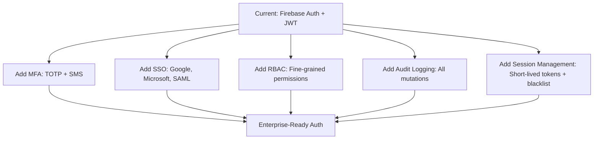
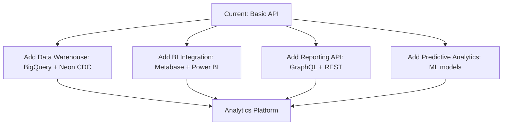
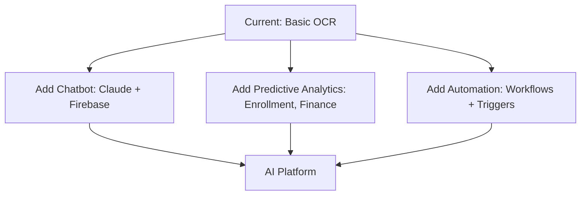
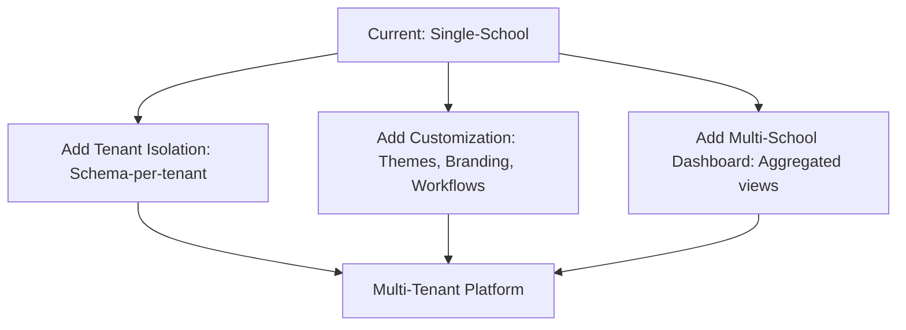

# Phikila School Management System: Enterprise-Grade Upgrade Audit

**Prepared by:** Phikila Technical Audit Team
**Date:** 2026-08-18
**Current Version:** 0.1.0 (MVP)
**Target:** Enterprise-Grade (Scalable, Secure, Maintainable, Compliant)

---

## 🔍 Executive Summary

Phikila is a modern school management system built on a **Cloudflare Workers + Neon Postgres backend** and **React + Vite frontend**, with **Firebase Auth** for authentication. The system is currently in **MVP stage** with **15+ domain modules** (students, finance, attendance, scheduling, examinations, etc.) and **39 frontend pages**.

### 📊 Current State Assessment

| Metric | Value | Enterprise Readiness (1-5) |
|--------|-------|-----------------------------|
| **Codebase Size** | ~120K lines (backend + frontend) | 3/5 |
| **Domain Coverage** | 15+ school management domains | 4/5 |
| **Authentication** | Firebase Auth + JWT | 3/5 |
| **Database** | Neon Postgres (serverless) | 4/5 |
| **Deployment** | Cloudflare Workers + Vercel | 3/5 |
| **CI/CD** | Manual migration workflow | 1/5 |
| **Testing** | Minimal (no unit/integration tests) | 1/5 |
| **Observability** | None | 1/5 |
| **Security** | Basic (JWT, CORS) | 2/5 |
| **Compliance** | None | 1/5 |
| **Scalability** | Serverless (good) | 4/5 |

**Overall Readiness:** 2.5/5 — **MVP-ready, not enterprise-ready**

### 🚀 Strategic Recommendations

**Critical Path (Must Fix):
1. 🔒 Security & Compliance (GDPR, FERPA, POPIA, PCI-DSS)
2. 🧪 Testing & Quality Assurance (Unit, Integration, E2E, Load)
3. 📊 Observability & Monitoring (Logging, Metrics, Alerting)
4. 🔄 CI/CD & DevOps (Automated Testing, Deployment, Rollback)
5. 🛡️ Disaster Recovery & Backup (Database, Media, Configuration)**

**High-Impact Upgrades:
1. 🔐 Authentication & Authorization (RBAC, MFA, SSO, Audit Logging)
2. 📈 Scalability & Performance (Caching, Rate Limiting, CDN)
3. 📊 Analytics & Reporting (Data Warehouse, BI Integration)
4. 🤖 AI & Automation (Chatbots, OCR, Predictive Analytics)
5. 🌐 Multi-School & Multi-Tenant (Isolation, Customization, Branding)**

---

## 🔧 Technical Audit Findings

### 1. 🛡️ Security & Compliance (Critical)

#### 🔴 Critical Issues

| Issue | Risk | Recommendation |
|-------|------|----------------|
| **No audit logging** | Compliance failure, no accountability | Add audit trail for all mutations (who, what, when, where) |
| **No rate limiting** | DDoS, brute force, API abuse | Implement Cloudflare Rate Limiting + Worker-level throttling |
| **No input validation** | SQL injection, XSS, data corruption | Add Zod validation for all API inputs |
| **No secrets management** | Credential leaks, unauthorized access | Use Cloudflare Workers Secrets + Vault integration |
| **No MFA** | Account takeover, credential stuffing | Add Firebase MFA + TOTP support |
| **No RBAC granularity** | Overprivileged users, data leaks | Implement fine-grained RBAC (e.g., `finance:read`, `students:write`) |
| **No data encryption** | Data breaches, compliance violations | Encrypt PII at rest (Neon TDE) and in transit (TLS 1.3) |
| **No compliance controls** | Legal risk, fines, reputational damage | Implement GDPR, FERPA, POPIA, PCI-DSS controls |

#### 🟡 High-Risk Issues

| Issue | Risk | Recommendation |
|-------|------|----------------|
| **JWT HS256 (symmetric)** | Token theft, replay attacks | Migrate to RS256 (asymmetric) + short-lived tokens |
| **CORS wildcard (`*`)** | CSRF, XSS, credential theft | Restrict CORS to known frontend domains |
| **No password policy** | Weak passwords, credential stuffing | Enforce password complexity + Firebase rules |
| **No session invalidation** | Session hijacking, stale sessions | Add JWT blacklist + short expiry (1h) |
| **No secrets rotation** | Long-term credential exposure | Rotate `JWT_SECRET`, `DATABASE_URL` quarterly |
| **No data masking** | PII exposure in logs, UI | Mask PII (email, phone, ID) in logs and non-privileged views |
| **No backup validation** | Data loss, unrecoverable failures | Test backups monthly + automated restore validation |

#### 🟢 Compliance Requirements

| Regulation | Requirement | Status | Action |
|------------|-------------|--------|--------|
| **GDPR** | Right to erasure, data portability, consent | ❌ Missing | Implement data export, deletion, consent management |
| **FERPA** | Student data protection, parental access | ❌ Missing | Add parental consent + student data access controls |
| **POPIA** | South Africa PII protection | ❌ Missing | Add POPIA consent banner + data subject access requests |
| **PCI-DSS** | Payment card security | ❌ Missing | Tokenize payments, never store raw card data |
| **ISO 27001** | Information security management | ❌ Missing | Implement ISMS, risk assessments, audits |

---

### 2. 🧪 Testing & Quality Assurance (Critical)

#### 🔴 Critical Issues

| Issue | Risk | Recommendation |
|-------|------|----------------|
| **No unit tests** | Bugs, regressions, low confidence | Add Vitest for frontend + Jest for backend |
| **No integration tests** | Broken contracts, API failures | Add Hono test client + Neon test database |
| **No E2E tests** | Broken user flows, UI regressions | Add Playwright for critical paths (login, enrollment, payments) |
| **No load testing** | Performance degradation, outages | Add k6 load tests for 10K+ concurrent users |
| **No test coverage** | Untested code, high risk | Enforce 80%+ coverage for critical domains |
| **No test data management** | Flaky tests, data leaks | Use synthetic test data + database snapshots |

#### 🟡 High-Risk Issues

| Issue | Risk | Recommendation |
|-------|------|----------------|
| **No CI/CD pipeline** | Manual deployments, human error | Add GitHub Actions for test, build, deploy |
| **No staging environment** | Untested changes in production | Add staging environment (Vercel + Cloudflare) |
| **No canary deployments** | Downtime, rollback pain | Implement canary deployments (10% traffic) |
| **No rollback strategy** | Extended downtime, data loss | Add automated rollback + database migration rollback |
| **No dependency scanning** | Vulnerable dependencies | Add Dependabot + Snyk for vulnerability scanning |

---

### 3. 📊 Observability & Monitoring (Critical)

#### 🔴 Critical Issues

| Issue | Risk | Recommendation |
|-------|------|----------------|
| **No logging** | No debugging, no auditing | Add structured logging (JSON) + Cloudflare Logs |
| **No metrics** | No performance insights | Add Prometheus + Grafana for backend metrics |
| **No error tracking** | Silent failures, poor UX | Add Sentry for frontend + backend errors |
| **No uptime monitoring** | Downtime goes unnoticed | Add UptimeRobot + Cloudflare Health Checks |
| **No alerting** | Issues go unnoticed for hours/days | Add PagerDuty + Slack alerts for critical failures |

#### 🟡 High-Risk Issues

| Issue | Risk | Recommendation |
|-------|------|----------------|
| **No distributed tracing** | Hard to debug latency issues | Add OpenTelemetry + Honeycomb |
| **No log retention policy** | Compliance violations, storage bloat | Retain logs for 1 year (GDPR) + archive to S3 |
| **No synthetic monitoring** | Broken user flows go unnoticed | Add synthetic tests for critical paths |
| **No SLOs/SLIs** | No reliability targets | Define SLOs (99.9% uptime) + error budgets |

---

### 4. 🔄 CI/CD & DevOps (Critical)

#### 🔴 Critical Issues

| Issue | Risk | Recommendation |
|-------|------|----------------|
| **Manual deployments** | Human error, downtime | Automate deployments (GitHub Actions) |
| **No automated testing** | Bugs reach production | Add test stage to CI pipeline |
| **No environment parity** | "Works on my machine" | Use Docker + Terraform for environment parity |
| **No rollback testing** | Failed rollbacks, extended downtime | Test rollback in staging before production |
| **No secrets in CI** | Credential leaks | Use GitHub Actions secrets + OIDC |

#### 🟡 High-Risk Issues

| Issue | Risk | Recommendation |
|-------|------|----------------|
| **No database migration testing** | Broken migrations, data loss | Test migrations in CI against snapshot |
| **No canary analysis** | Performance regressions | Add canary analysis (error rate, latency) |
| **No feature flags** | Big bang releases, high risk | Add LaunchDarkly for feature flagging |
| **No changelog** | Poor visibility, compliance | Add automated changelog (Conventional Commits) |

---

### 5. 🛡️ Disaster Recovery & Backup (Critical)

#### 🔴 Critical Issues

| Issue | Risk | Recommendation |
|-------|------|----------------|
| **No automated backups** | Data loss, unrecoverable failures | Add Neon automated backups + R2 for media |
| **No backup validation** | Corrupt backups, false security | Test backups monthly + automated restore validation |
| **No disaster recovery plan** | Extended downtime, data loss | Write DR plan + run quarterly drills |
| **No media backups** | Lost documents, photos | Backup R2 to secondary region + S3 |
| **No configuration backups** | Lost secrets, settings | Backup `wrangler.toml`, `.env`, Firebase config |

#### 🟡 High-Risk Issues

| Issue | Risk | Recommendation |
|-------|------|----------------|
| **No multi-region deployment** | Regional outages, downtime | Deploy to multiple Cloudflare regions |
| **No database failover** | Extended downtime | Add Neon read replicas + failover |
| **No R2 replication** | Data loss | Enable R2 replication to secondary region |

---

## 🚀 High-Impact Upgrades

### 1. 🔐 Authentication & Authorization

#### 🔧 Implementation Plan



#### 📋 Requirements

| Feature | Description | Priority |
|---------|-------------|----------|
| **MFA** | TOTP + SMS for all users | P0 |
| **SSO** | Google, Microsoft, SAML 2.0 | P0 |
| **RBAC** | Fine-grained permissions (e.g., `finance:read`, `students:write`) | P0 |
| **Audit Logging** | Log all mutations (who, what, when, where) | P0 |
| **Session Management** | Short-lived tokens (1h) + JWT blacklist | P1 |
| **Password Policy** | Enforce complexity + rotation | P1 |

---

### 2. 📈 Scalability & Performance

#### 🔧 Implementation Plan

```mermaid
graph TD
    A[Current: Serverless (Workers + Neon)] --> B[Add Caching: Cloudflare Cache + Redis]
    A --> C[Add Rate Limiting: Cloudflare + Worker-level]
    A --> D[Add CDN: Cloudflare CDN for static assets]
    A --> E[Add Database Optimization: Indexes, Query Planning]
    A --> F[Add Load Testing: k6 for 10K+ users]
    B --> G[Scalable Architecture]
    C --> G
    D --> G
    E --> G
    F --> G
```

#### 📋 Requirements

| Feature | Description | Priority |
|---------|-------------|----------|
| **Caching** | Cloudflare Cache + Redis for API responses | P0 |
| **Rate Limiting** | Cloudflare Rate Limiting + Worker-level throttling | P0 |
| **CDN** | Cloudflare CDN for static assets | P0 |
| **Database Optimization** | Add indexes, optimize queries, Neon query planning | P1 |
| **Load Testing** | k6 load tests for 10K+ concurrent users | P1 |
| **Auto-Scaling** | Neon auto-scaling + Workers auto-scaling | P2 |

---

### 3. 📊 Analytics & Reporting

#### 🔧 Implementation Plan



#### 📋 Requirements

| Feature | Description | Priority |
|---------|-------------|----------|
| **Data Warehouse** | BigQuery + Neon CDC for analytics | P1 |
| **BI Integration** | Metabase + Power BI for dashboards | P1 |
| **Reporting API** | GraphQL + REST for custom reports | P1 |
| **Predictive Analytics** | ML models for enrollment, finance, attendance | P2 |

---

### 4. 🤖 AI & Automation

#### 🔧 Implementation Plan



#### 📋 Requirements

| Feature | Description | Priority |
|---------|-------------|----------|
| **Chatbot** | Claude-powered chatbot for support + self-service | P1 |
| **Predictive Analytics** | ML models for enrollment, finance, attendance | P2 |
| **Automation** | Workflows + triggers for repetitive tasks | P2 |

---

### 5. 🌐 Multi-School & Multi-Tenant

#### 🔧 Implementation Plan



#### 📋 Requirements

| Feature | Description | Priority |
|---------|-------------|----------|
| **Tenant Isolation** | Schema-per-tenant + row-level security | P0 |
| **Customization** | Themes, branding, workflows per school | P1 |
| **Multi-School Dashboard** | Aggregated views for platform admins | P1 |
| **Cross-School Analytics** | Comparative analytics (enrollment, finance) | P2 |

---

## 📅 Roadmap (12-18 Months)

| Phase | Duration | Focus | Key Deliverables |
|-------|----------|-------|------------------|
| **Phase 0: Stabilization** | 0-3 months | Security, Testing, Observability | Audit logging, MFA, SSO, CI/CD, unit tests, observability |
| **Phase 1: Scalability** | 3-6 months | Performance, Reliability | Caching, rate limiting, CDN, load testing, auto-scaling |
| **Phase 2: Compliance** | 6-9 months | GDPR, FERPA, POPIA, PCI-DSS | Data encryption, consent management, audit trails, compliance reports |
| **Phase 3: Analytics** | 9-12 months | Data Warehouse, BI, Reporting | BigQuery, Metabase, reporting API, predictive analytics |
| **Phase 4: AI & Automation** | 12-15 months | Chatbot, Predictive Analytics | Claude chatbot, ML models, workflow automation |
| **Phase 5: Multi-Tenant** | 15-18 months | Multi-School, Customization | Tenant isolation, customization, multi-school dashboard |

---

## 💰 Budget Estimate

| Category | Estimated Cost (USD) | Notes |
|----------|----------------------|-------|
| **Security & Compliance** | $150,000 | MFA, SSO, audit logging, encryption, compliance audits |
| **Testing & QA** | $100,000 | Unit tests, integration tests, E2E tests, load testing |
| **Observability** | $80,000 | Logging, metrics, alerting, Sentry, Grafana |
| **CI/CD & DevOps** | $70,000 | GitHub Actions, Terraform, Docker, staging environment |
| **Disaster Recovery** | $50,000 | Backups, replication, DR plan, drills |
| **Scalability** | $120,000 | Caching, rate limiting, CDN, load testing, auto-scaling |
| **Analytics** | $100,000 | BigQuery, Metabase, reporting API, predictive analytics |
| **AI & Automation** | $150,000 | Claude chatbot, ML models, workflow automation |
| **Multi-Tenant** | $200,000 | Tenant isolation, customization, multi-school dashboard |
| **Contingency (20%)** | $204,000 | Unforeseen challenges, scope changes |
| **Total** | **$1,224,000** | 12-18 month program |

---

## 🎯 Success Metrics

| Metric | Target | Measurement |
|--------|--------|-------------|
| **Uptime** | 99.9% | Cloudflare + UptimeRobot |
| **MTTR** | < 15 minutes | PagerDuty + Sentry |
| **Test Coverage** | 80%+ | Vitest + Jest |
| **Load Capacity** | 10K+ concurrent users | k6 load tests |
| **Compliance** | 100% (GDPR, FERPA, POPIA, PCI-DSS) | Internal + external audits |
| **Deployment Frequency** | Daily | GitHub Actions |
| **Lead Time for Changes** | < 1 hour | GitHub Actions |
| **Mean Time to Recovery** | < 5 minutes | Rollback testing |
| **Customer Satisfaction** | 90%+ | Surveys + NPS |

---

## 🏁 Conclusion

Phikila is a **promising MVP** with **strong technical foundations** (Cloudflare Workers, Neon Postgres, React), but **lacks enterprise-grade security, testing, observability, and compliance**. The **12-18 month roadmap** outlined above will transform Phikila into a **scalable, secure, maintainable, and compliant** platform suitable for **large school networks, districts, and education ministries**.

**Next Steps:**
1. **Prioritize Phase 0 (Stabilization)** — Security, testing, observability, CI/CD
2. **Secure budget approval** — $1.2M over 12-18 months
3. **Assemble cross-functional team** — Security, DevOps, QA, Compliance, Data
4. **Kick off Phase 0** — Audit logging, MFA, SSO, CI/CD, unit tests

**Prepared by:** Phikila Technical Audit Team
**Date:** 2026-08-18